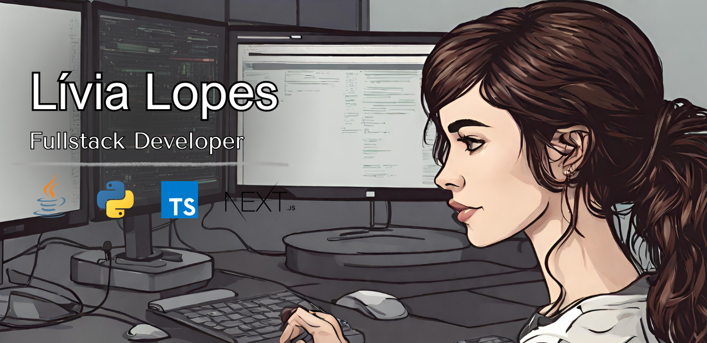

  

#     

Hello! I'm Lívia Lopes, a recent graduate in Systems Analysis and Development from FIAP 🎓.

I'm a developer who is passionate about continuous learning and using technology to solve real-world problems. I am always dedicated to learning new technologies and deepening my knowledge of programming languages.

### My Stack

  

